<table width="100%">
 <tr width="100%">
    <td align="center"><h1>Versal&trade; Adaptive SoC Tutorials for CPM DMA and Bridge Mode for PCIe&reg;</h1>
    </td>
 </tr>
</table>

# Lab 1: QDMA AXI MM Interface to NoC and DDR Lab

This lab describes the process of generating a AMD Versal&trade; adaptive SoC QDMA design with AXI4 Memory Mapped interface connected to network on chip (NoC) IP and DDR memory. This design has the following configurations:
* AXI4 memory mapped (AXI MM) connected to DDR through the NoC IP
* Gen3 x 16
* MSI-X interrupts

This lab provides step by step instructions to configure a Control, Interfaces and Processing System (CIPS) QDMA design and network on chip (NoC) IP. The following figure shows the AXI4 Memory Mapped (AXI-MM) interface to DDR using the NoC IP. At the end of this lab, you can synthesize and implement the design, and generate a Programmable Device Image (PDI) file. The PDI file is used to program the AMD Versal adaptive SoC and run data traffic on a system. For the AXI-MM interface host to chip (H2C) transfers, data is read from Host andsent to DDR memory. For chip to host (C2H) transfers, data is read from DDR memory and written to host.

This lab targets a xcvc1902-vsvd1760-1LP-e-S-es1 part on a VCK5000 board. This lab connects to DDR memory found outside the adaptive SoC.

**AXI4 Memory Mapped to DDR Design**
    

## Start the Vivado Design Suite

1. Open the AMD Vivado&trade; Design Suite.
2. Click **Create Project** from the Quick Start Menu.
3. Step through the popup menus to access the Default Part page.
4. In the Default Part page, in the Select Boards option and select the **Versal VCK190 Evaluation Platform** option.
5. Continue to the Finish stage to create the new project and open Vivado.
6. In the Vivado Flow Navigator, click **IP Integrator → Create Block Design**. A dialog box is displayed to create the block design.

    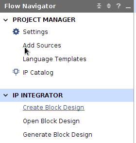
7. Click **OK**. An empty block design diagram canvas opens.

## Instantiate the CIPS IP

1. Right-click the block design canvas, and from the context menu select **Add IP**. 
2. The IP catalog pops up. In the Search field, type CIPS to filter to the list of IP.   
    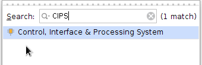
3. From the filtered list, double-click the **Control, Interface, and Processing System** IP core to instantiate the IP on the block design canvas.
4. This adds the AMD Versal adaptive SoC CIPS IP to the canvas. Double-check **Versal CIPS IP**.
5. CIPS configuration page will open, make sure Design flow has Full System selected and click next.
    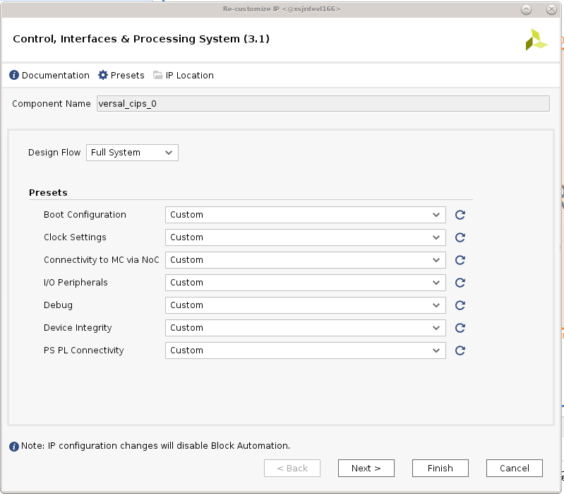
6. CIPS PS and CPM configuration page opens. Select **CPM**.
    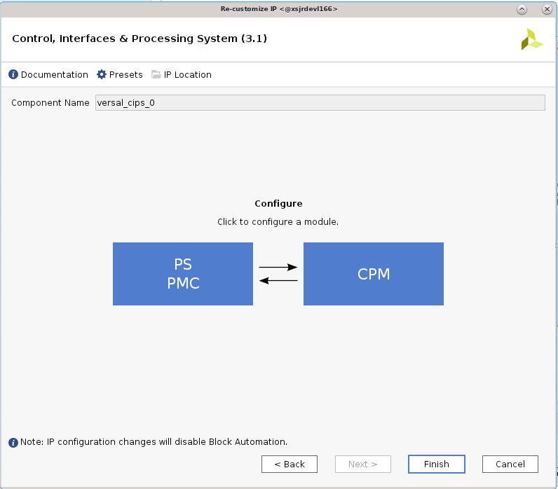
7. CPM4 Configuration dialog box displays. Select the **CPM4 Basic Configuration** option.
8. Set the PCIe Controller 0 Modes to **DMA**, and set the lane width to **X16**. Available lane widths are X4, X8 and X16. X1 and X2 are not supported.
    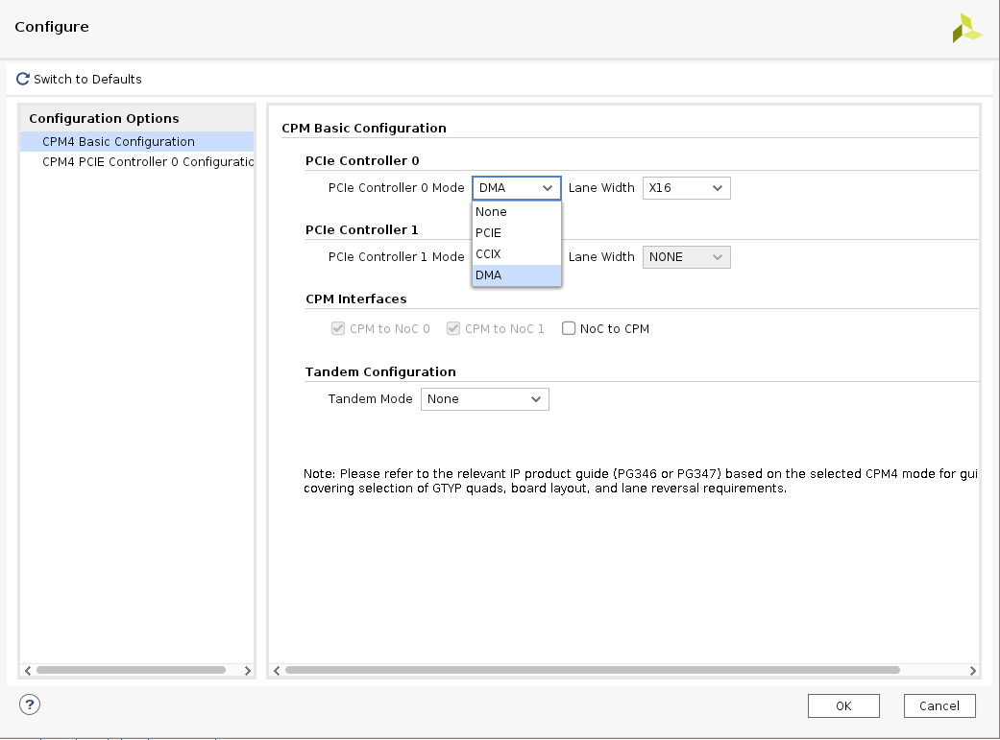

## Set the PCIe Reset Pin

Because the Board option is selected, there is no need to select a pin for PCIe Reset. However, if the Evaluation Board option is not selected, and the user application has a AMD Versal adaptive SoC part, then the PCIe. Reset pin must be set correctly. Follow the steps below to set the PCIe Reset pin.

1. In the CIPS PS CPM Configuration page, select **PS-PMC**, and click **IO Configuration**.

    The IO Configuration page displays with a list of options to configure the CPM-PCIe functional mode.
2. In the Peripheral column, select the **PCIe Reset**.

    Notice that CPM PCIE Controller 0 (End Point) by default is set to the **PS MIO 18** pin.

3. Select the MIO pin based on your design for the PCIe reset connection.

   The available MIO pin selections are PS MIO 18, PMC MIO 24, and PMC MIO 38.

   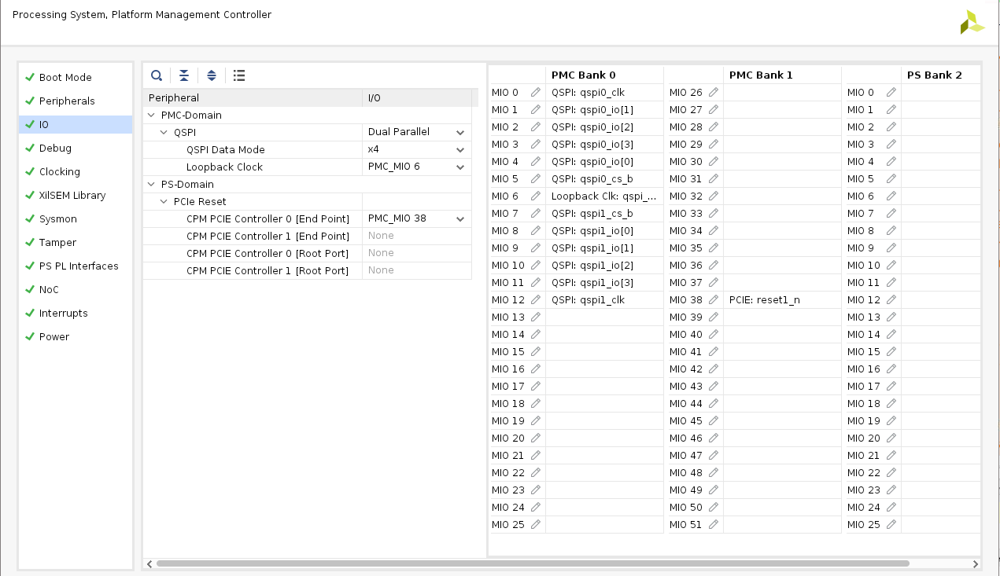

## CPM Configuration

1. In the Configuration Options pane, select **CPM4 PCIE Controller 0 Configuration**, to customize the DMA.
2. In the Basic tab, set the following options:
    - PCIe0 Basic/Advanced mode selection: **Advanced**.
    - PCIe0 Functional Mode: **QDMA**.
    - Maximum Link Speed: **8.0 GT/s** (Gen3).
    - DMA Interface option: **AXI Memory Mapped**.

    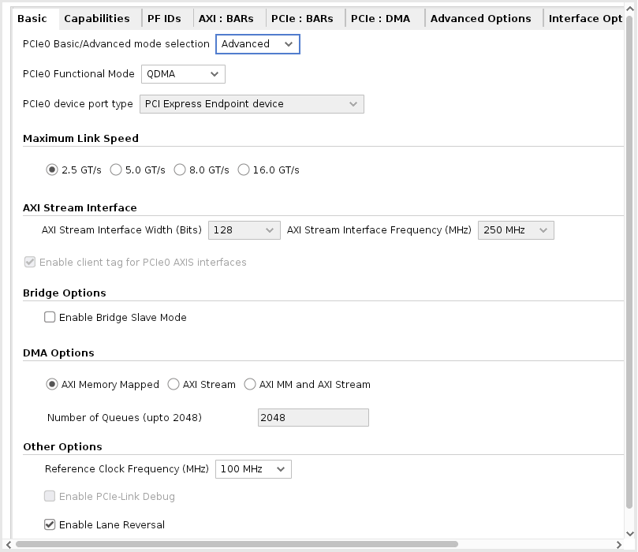
3. In the Capabilities tab, set the following option:
    - Total Physical Functions: **4**
    - MSI-X Options: **MSI-X Internal**
    
    This option enables the CPM QDMA in MSI-X internal mode.
  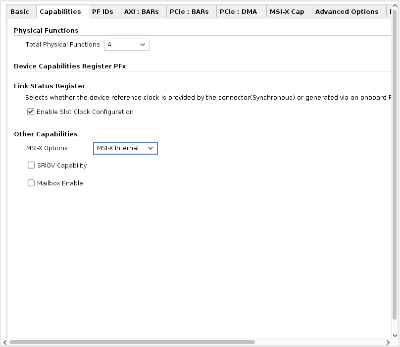

4. In the PF ID tab, there are 4 PFs listed with device ID. Based on your need, you can modify the device ID. For this lab, keep the default device ID.
5. In the PCIe: BAR tab, set the following options: 
    - First row (for BAR0):
        - Select the **Bar** checkbox.
        - Set type to **DMA**.
        - Select the **64 bit** checkbox.
        - Select the **Prefetchable** checkbox.
        - Set size to **128 Kilobytes**. 
    - Second row (for BAR2):
        - Select the **Bar** checkbox.
        - Set type to **AXI Bridge Master**.
        - Select the **64 bit** checkbox.
        - Select the **Prefetchable** checkbox.
        - Set size to **4 Kilobytes**.

    The same Bar options can be copied for all 4 PFs. Depending on your needs, you can modify the BAR selection for all PFs. For this lab, copy PF10 selection to all 3 PFs. To do so, click **Copy PF0**.

    ***Note*:** By default DMA will not be selected for any BAR, User need to select DMA option in Type section in order to get DMA bar.

    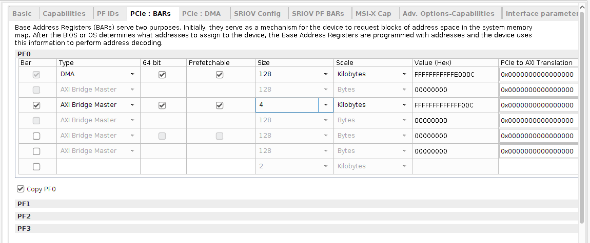

6. In the PCIe: DMA tab keep all default selections.

7. Click **OK** and click **Finish** in the CIPS configuration page to generate the CIPS QDMA IP.

## NoC Configuration

Next you will add and configure a Network on Chip (NoC) IP core for the DDR connection.

1. Right-click the block design canvas and from the context menu select **Add IP**.
2. The IP catalog pops up. In the Search field type AXI NoC to filter a list of IP.
3. From the filtered list, double-click the **AXI NoC** IP core to instantiate the IP on the block design canvas.
Customize the IP as follows.
4. In the General tab, set the following options:
    - Number of AXI Slave Interfaces: **2**.
    - Number of AXI Master Interfaces: **0**.
    - Number of AXI Clocks: **2**.

    The number of AXI clocks is set to two because there are two clocks needed for the AXI Slave input, and none needed for AXI Master output.
    - Memory Controller: **Single Memory Controller**.
    - Number of Memory Controller Port: **4**.
    - All others options use the default settings.

    

5. In the Inputs tab, set the following options. 
    - First row (for S00_AXI):
        - Connected To: **PS PCIe**.
        - Clock: **aclk0** (input clock).
        - All other options use default settings. 
    - Second row (for S01_AXI):
        - Connected To: **PS PCIe**.
        - Clock: **aclk1** (input clock).
        - All other options use default settings.

    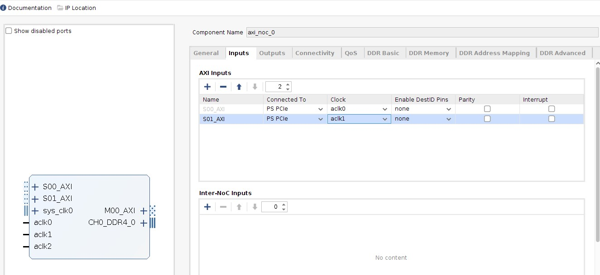

6. In the Connectivity tab, set the NoC connectivity as follows:
    - For S00_AXI, select the **MC Port 0** checkbox.
    - For S01_AXI, select the **MC Port 0** checkbox.
    - All others options use the default settings.
7. In the DDR Basic tab, set the following options:
    -   Input System clock period (ps): **5000 (200.000 MHz)**.
    -   Select the **Enable Internal Responder** checkbox.
    -   All other options use the default settings.

    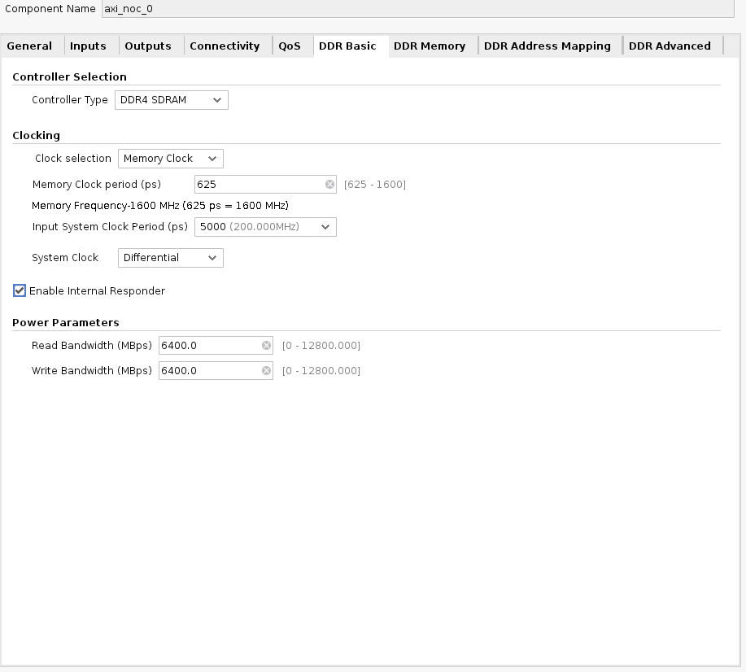

 ***Note*:** This is a sample configuration. Your DDR configuration and frequencies should be based on your design requirements.

8.  In the DDR Memory tab, set the following options:
    - Memory Device Type: **Components**.
    - Memory Speed Grade: **DDR4-3200AA(22-22-22)**.
    - Base Component Width: **x16**.
    - All others options use the default settings.

    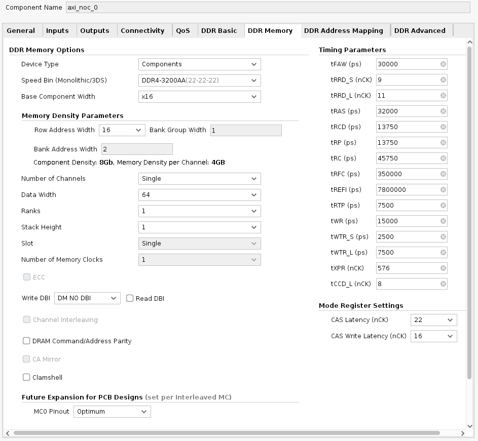

9. Click **OK** to generate a NoC IP with DDR.

## Generate the Clock for the NoC IP

 Next, generate a clock source for the NoC module. To do this, you will configure and generate the Simulation Clock and Reset Generator IP core.

1. Click **Add IP**, and search for Simulation Clock and Reset
    Generator.
2. From the filtered list, double-click the **Simulation Clock and Reset Generator** IP core to instantiate the IP on the block design canvas. Configure the core as follows:
3. For Number of SYS clocks, select **1**.
4. For Sys Clock 0 Frequency (MHz), enter **200**.
5. For Number of AXI Clocks, select **0**.
6. For Number of Resets Ports, select **0**.
7. Click **OK** to generate IP.

    

## IP Configuration

1. Make the connections between the IP cores as shown in following figure.
2. Set GT_REFCLK_D, GT_PCIEA0_RX, GT_PCIEA0_TX, SYS_CLK0_IN, and CH0_DDR4_0 as primary ports. To do so:

    a. Select pins gt_refclk0, and PCIE0_GT of versal_cips_0, SYS_CLK0_IN of clk_gen_sim_0, and CH0_DDR4_0 of axi_noc_0 by pressing **Ctrl+click**.

    b. Click the **Make External (Ctrl + T)** icon in the toolbar at the top of the canvas.
3. Add a Constant IP, and configure the IP to generate a constant value of logic 1.
    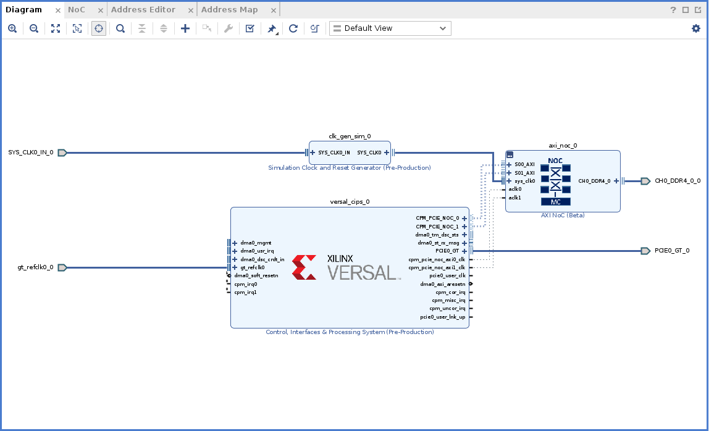

## Address Settings

 Next, set the necessary address settings for the NoC IP.

1.  Open the **Address Editor** tab as shown in the following figure. Expand the tree by clicking the down-arrow on **versal_cips_0**. Expand **DATA_PCIE0**, and expand **DATA_PCIE1**.
2.  For S00_AXI, right-click in the Master Base Address cell, and select **Assign** from the context menu.
3.  And similarly, for S01_AXI, right-click in the Master Base Address cell, and select **Assign** from the context menu.
Note that the address 0x00000 is assigned to the DDR.
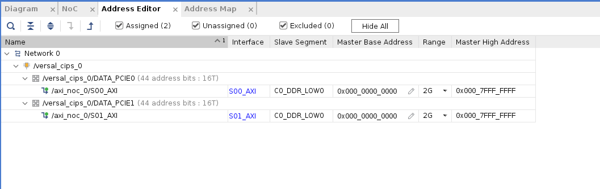

## Validate the Block Design

1. To validate the design, open the Diagram tab, and click the **Validate Design** icon , or right- click anywhere in the canvas and, from the context menu, select **Validate Design**.

    After validation, confirmation of the successful validation displays in a pop-up window.

## Create a Design Wrapper

After validation, create a design wrapper. A design wrapper file enables you to add any needed logic. For this lab, additional logic is not needed.

1. In the Vivado IDE Sources window, right-click on **design_1 (design_1.bd)**.
2. From the context menu, select **Create HDL Wrapper** to generate a wrapper file.

    A `design_1\_wrapper` file is added to the Sources window as shown in the following figure.

    

## Synthesize and Implement the Design

The IP package includes the DDR pin placement for the evaluation board. To implement the project design, and generate a Programmable Device Image (PDI) file:

1. In the Flow Navigator, click **Synthesis and Implementation**.

Copyright © 2020–2023 Advanced Micro Devices, Inc

<a href="https://www.amd.com/en/corporate/copyright">Terms and Conditions</a>

