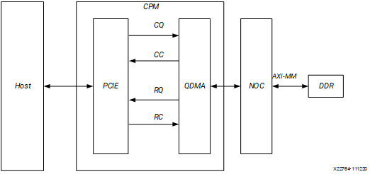
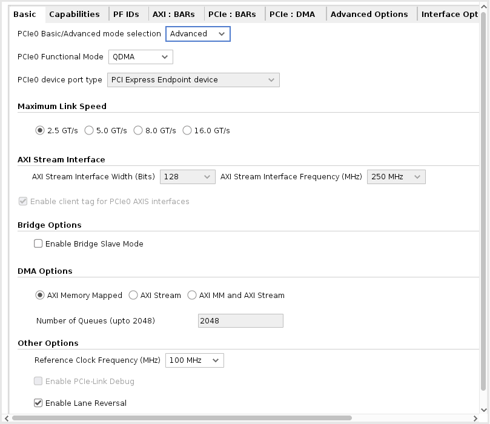
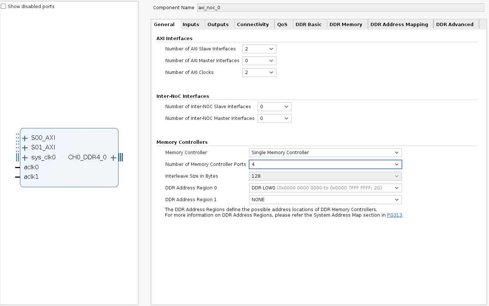
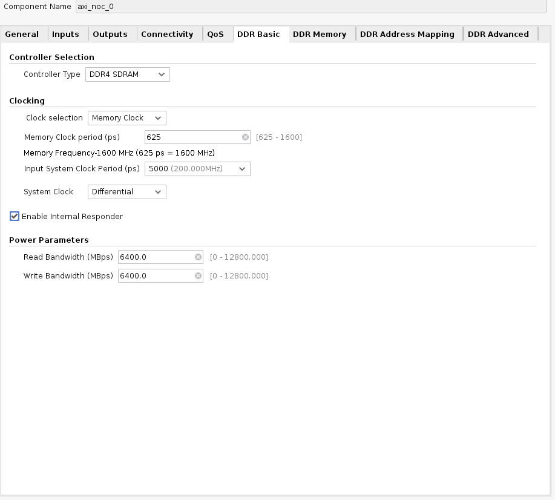
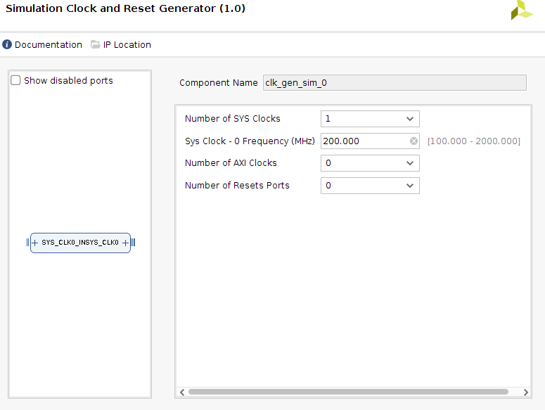
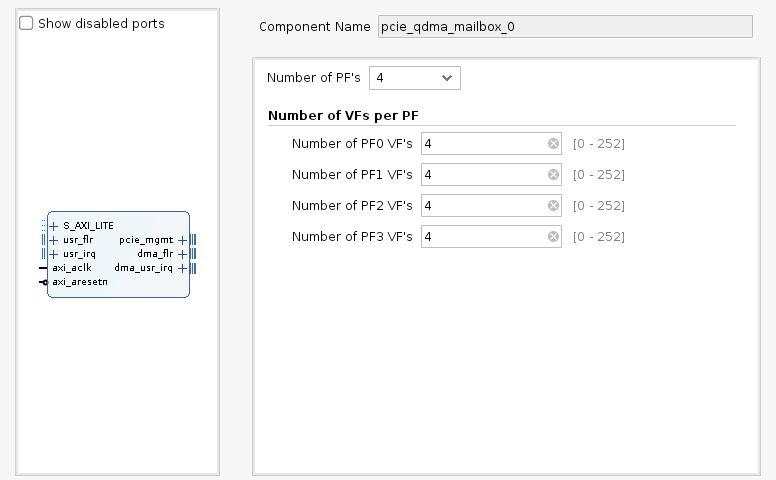
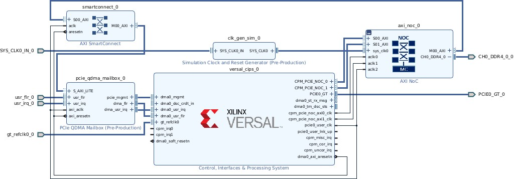
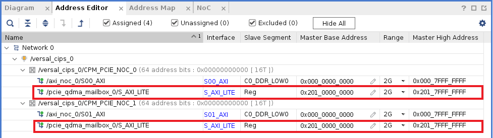
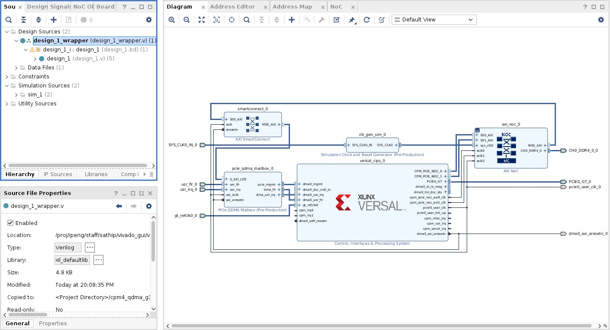

<table width="100%">
 <tr width="100%">
    <td align="center"><h1>Versal™ Adaptive SoC Tutorials for CPM DMA and Bridge Mode for PCIe&reg;
</h1>
    </td>
 </tr>
</table>

# Lab 2: QDMA AXI MM Interface to NoC and DDR with Mailbox Lab

This lab describes the process of generating a AMD Versal&trade; adaptive SoC QDMA design containing 4 PFs, 252 VFs and AXI4 Memory Mapped interface connected to the network on chip (NoC) IP and DDR memory. This design has the following configurations:

• AXI4 memory mapped (AXI MM) connected to DDR through the NoC IP

• Gen3 x 16

• 4 physical functions (PFs) and 252 virtual functions (VFs) with
Mailbox connections.

• MSI-X interrupts

This lab provides step by step instructions to configure a Control, Interfaces and Processing System (CIPS) QDMA design and network on chip (NoC) IP. The following figure shows the AXI4 Memory Mapped (AXI-MM) interface to DDR using the NoC IP. At the end of this lab, you can synthesize and implement the design, and generate a Programmable Device Image (PDI) file. The PDI file is used to program the AMD Versal adaptive SoC and run data traffic on a system. For the AXI-MM interface host to chip (H2C) transfers, data is read from Host and sent to DDR memory. For chip to host (C2H) transfers, data is read from DDR memory and written to host.

This lab targets a xcvc1902-vsvd1760-1LP-e-S-es1 part on a VCK5000 board. This lab connects to DDR memory found outside the adaptive SoC.

**AXI4 Memory Mapped to DDR Design**

Lab 2 initial configurations are the same as in Lab 1. So follow Start the AMD Vivado&trade; Design Suite, Instantiate CIPS IP, and Set the PCIe&reg; Reset Pin sections from Lab 1. Refer to [Lab1: QDMA AXI MM Interface to NoC and DDR Lab](/docs/Lab1/Lab1.md).

## CPM Configuration

1.  In the Configuration Options pane, select **CPM4 PCIE Controller 0 Configuration** to customize the DMA .
2.  In the Basic tab, set the following options:
    -   PCIe0 Basic/Advanced mode selection: **Advanced**.
    -   PCIe0 Functional Mode: **QDMA**.
    -   Maximum Link Speed: **8.0 GT/s** (Gen3).
    -   DMA Interface option: **AXI Memory Mapped**.

3.  In the Capabilities tab, set the following option:
    -   Total Physical Functions: **4**
    -   MSI-X Options: **MSI-X Internal**

    This option enables the CPM QDMA in MSI-X internal mode.
    -   Select **SRIOV Capability** option
    -   Select **Mailbox Enable** Option

    ***Note*:** Mailbox for CPM is a separate IP called PCIe qdma mailbox IP that you need to add to the IP canvas.

    

4.  In the PF ID tab, there are 4 PFs listed with device ID. Based on
    your need, you can modify the device ID. For this lab, keep the
    default device ID.

5.  In the PCIe: BAR tab, set the following options: 
    
    First row (for BAR0):
    -   Select the **Bar** checkbox.
    -   Set type to **DMA**.
    -   Select the **64 bit** checkbox.
    -   Select the **Prefetchable** checkbox.
    -   Set size to **128 Kilobytes**.
    -   PCIe to AXI Translation should be set to the address that is set in the Address Settings section.

    ***Note*:** By default DMA will not be selected for any BAR, User need to select DMA option in Type section in order to get DMA bar.

    For each DMA bar that is selected, "PCIe to AXI Translation" needs to be set with default address offset + PF address offset value.
    -   Mialbox Address offset will come from "Address Editor" tab when
    configuring the NoC IP. This will be constant for all the PF's
    -   PF address offset values are at *bits\[26:24\]*
        -   3'b000 : PF0
        -   3'b001 : PF1
        -   3'b010 : PF2
        -   3'b011 : PF3
    -   Mailbox Address offset + PF address offset should be programmed in "PCIe to AXI Translation" column.

    ***Note*:** PCIe to AXI Address translation is very important parameter option that need to be set properly in order for NoC to send mailbox access to proper Mailbox IP.
6.  In the PCIe: DMA tab, keep all default selections.
7.  In the SRIOV Config tab, keep all default selection.
8.  In SRIOV VF BARs tab, select following options:
    In this Tab, the user must select BARs for each VFG. In this lab, select only DMA bar with the default size.

    First row (for BAR0):
    -   Select the **Bar** checkbox.
    -   Set type to **DMA**.
    -   Select the **64 bit** checkbox.
    -   Select the **Prefetchable** checkbox.
    -   Set size to **16 Kilobytes**.
    -   Set Address Settings to **PCIe to AXI Translation**.

    ***Note*:** By default, the DMA is not selected for any BARs. Select the DMA option in the Type section in order to specify DMA BAR.

    For each DMA bar that is selected, "PCIe to AXI Translation" needs to be set with default address offset + PF address offset value.
    -   Mialbox Address offset will come from "Address Editor" tab when
    configuring the NoC IP. This will be constant for all the PF's
    -   PF address offset values are at *bits\[26:24\]*
        -   3'b100 : VFG0
        -   3'b101 : VFG1
        -   3'b110 : VFG2
        -   3'b111 : VFG3
    -   Mailbox Address offset + PF address offset should be programmed in "PCIe to AXI Translation" column.

    ***Note*:** PCIe to AXI Address translation is very important parameter option that need to be set properly in order for NoC to send mailbox access to proper Mailbox IP.
9.  Click **OK** and click **Finish** in the CIPS configuration page to
    generate the CIPS QDMA IP.

## NoC Configuration

Next you will add and configure a Network on Chip (NoC) IP core for the DDR connection.

1.  Right-click the block design canvas and from the context menu select
    **Add IP**.
2.  The IP catalog pops up. In the Search field, type AXI NoC to filter
    a list of IP.
3.  From the filtered list, double-click the **AXI NoC** IP core to
    instantiate the IP on the block design canvas. Customize the IP as follows:
4.  In the General tab, set the following options:
    -   Number of AXI Slave Interfaces: **2**.
    -   Number of AXI Master Interfaces: **1**(AXI Master connecting to Mailbox IP).
    -   Number of AXI Clocks: **3**.
    
    The number of AXI clocks is set to two because there are two clocks needed for the AXI Slave input, and none needed for AXI Master output.
    -   Memory Controller: **Single Memory Controller**.
    -   Number of Memory Controller Port: **4**.
    -   All others options use the default settings.

    

5.  In the Inputs tab, set the following options. First row (for S00_AXI):
    -   Connected To: **PS PCIe**.
    -   Clock: **aclk0** (input clock).
    -   All other options use default settings. Second row (for S01_AXI):
    -   Connected To: **PS PCIe**.
    -   Clock: **aclk1** (input clock).
    -   All other options use default settings.

    

6.  In the Outputs tab, set AXI Master output to proper clock. Assign aclk3 to M00_AXI interface.
7.  In the Connectivity tab, set the NoC connectivity as follows:
    -   For S00_AXI, select the **MC Port 0** and **MM_AXI pl** checkbox.
    -   For S01_AXI, select the **MC Port 0** and **MM_AXI pl** checkbox.
    -   This settings assures Mailbox can be assessed from either of the ports. All others options use the default settings.
8.  In the DDR Basic tab, set the following options:
    -   Input System clock period (ps): **5000 (200.000 MHz)**.
    -   Select the **Enable Internal Responder** checkbox.
    -   All others options use the default settings.

    

    ***Note*:** This is a sample configuration. Your DDR configuration and frequencies should be based on your design requirements.
9.  In the DDR Memory tab, set the following options:
    -   Memory Device Type: **Components**.
    -   Memory Speed Grade: **DDR4-3200AA(22-22-22)**.
    -   Base Component Width: **x16**.
    -   All others options use the default settings.

    
10. Click **OK** to generate a NoC IP with DDR.

## Generate the Clock

Next, generate a clock source for the NoC module. To do this, you will configure and generate the Simulation Clock and Reset Generator IP core.

1.  Click **Add IP**, and search for Simulation Clock and Reset Generator.
2.  From the filtered list, double-click the **Simulation Clock and Reset Generator** IP core to instantiate the IP on the block design canvas. Configure the core as follows:
3.  For Number of SYS clocks, select **1**.
4.  For Sys Clock 0 Frequency (MHz), enter **200**.
5.  For Number of AXI Clocks, select **0**.
6.  For Number of Resets Ports, select **0**.
7.  Click **OK** to generate IP.

## Mailbox IP

Next, generate a Mailbox IP and connect to NoC for Mailbox VF/PF communication.

1.  Click **Add IP**, and search for PCIe QDMA Mailbox.
2.  From the filtered list, double-click the **PCIe QDMA Mailbox** IP core to instantiate the IP on the block design canvas. Configure the core as follows:
    -   Select number of PFs that are needed. In this Lab, select 4 PFs.
    -   Select number of VFs. In this Lab, select VFs, as 4 for each PF.

    ***Note*:** Number of VFs should match number of VF that are selected in CIPS IP. This important to match the PFs and VFs that are selected. Otherwise IP will not work properly.

3.  In addition, add **AXI SmartConnect IP**. This IP is needed as Mailbox IP can only take in AXI4- Lite access. AXI interface from the NoC is full AXI.
    -   Configure the IP to have one Master, one Slave one clock, and one reset

## IP Configuration

1.  Make the connections between the IP cores, as shown in following figure.
2.  Set GT_REFCLK_D, GT_PCIEA0_RX, GT_PCIEA0_TX,SYS_CLK0_IN, and CH0_DDR4_0 as primary ports. To do so:

    a.  Select pins gt_refclk0, and PCIE0_GT of versal_cips_0,SYS_CLK0_IN of clk_gen_sim_0, and CH0_DDR4_0 of axi_noc_0 by pressing **Ctrl+click**.

    b.  Click the **Make External (Ctrl + T)** icon in the toolbar at the top of the canvas.

3.  Connect AXI Master*MM0_AXI* from NoC to SmartConnect IP. Output of SmartConnect connect to AXI Slave input of Mailbox IP.
4.  Connect dma_flr and dma_usr_irq from Mailbox IP to dma0_usr_irq and dma0_usr_flr input in CIPS IP.
5.  Change the Mailbox IP input ports usr_flr and usr_irq as primary input ports.
6.  All other colc and reset pins connect as shown in picture below.

**CPM4 Mailbox Connection**

## Address Settings

Next, set the necessary address settings for the NoC IP.

1.  Open the **Address Editor** tab, as shown in the following figure. Expand the tree by clicking the down-arrow on **versal_cips_0**. Expand **CPM_PCIE_NOC_0**, and expand **CPM_PCIE_NOC_1**.
2.  For S00_AXI, right-click in the Master Base Address cell, and select **Assign** from the context menu.

    ***Note*:** The address 0x00000 is assigned to the DDR.
3.  For pcie_qdma_mailbox0, right-click in the Master Base Address cell,and select **Assign** from the context menu. Optionally, you can also assign a fixed value; the value must be valid for NoC addressing.
4.  And similarly for pcie_qdma_mailbox0 on NoC1, right-click in the Master Base Address cell, and select **Assign** from the context menu. Also, you must assign an address range to 2G for both NoC0 and NoC1 for mailbox access.

    ***Note*:** These Mailbox addresses must be reflected in the PCIe to AXI Translation column in the PCIE BAR tab and SRIOV BARs tab in CIPS IP configuration.

    

## Validate the Block Design

1. To validate the design, open the Diagram tab, and click the **Validate Design** icon , or right-click anywhere in the canvas and, from the context menu, select **Validate Design**.

    After validation, confirmation of the successful validation displays in a popup window.

## Create a Design Wrapper

After validation, create a design wrapper. A design wrapper file enables you to add any needed logic. For this lab, additional logic is not needed.

1.  In the AMD Vivado&trade; IDE Sources window, right-click on **design_1 (design_1.bd)**.
2.  From the context menu, select **Create HDL Wrapper** to generate a wrapper file.

    A design_1\_wrapper file is added to the Sources window as shown in the following figure.

    

## Synthesize and Implement the Design

The IP package includes the DDR pin placement for the evaluation board. To implement the project design, and generate a Programmable Device Image (PDI) file:

1. In the Flow Navigator, click **Synthesis and Implementation**.

Copyright © 2020–2023 Advanced Micro Devices, Inc

<a href="https://www.amd.com/en/corporate/copyright">Terms and Conditions</a>

