<table width="100%">
 <tr width="100%">
    <td align="center"><h1>Versal&trade; Adaptive SoC Tutorials for CPM DMA and Bridge Mode for PCIe&reg;</h1>
    </td>
 </tr>
</table>

# Lab 3: QDMA AXI MM Interface to NoC and DDR Lab

This lab describes the process of generating a AMD Versal&trade; adaptive SoC QDMA design with AXI4 Memory Mapped interface connected to network on chip (NoC) IP and DDR memory. This design has the following configurations:
* AXI4 memory mapped (AXI MM) connected to DDR through the NoC IP
* Gen3 x 16
* 4 physical functions (PFs) and 252 virtual functions (VFs)
* MSI-X interrupts

This lab provides step by step instructions to configure a Control Interfaces and Processing System (CIPS) QDMA design and network on chip (NoC) IP. The following figure shows the AXI4 Memory Mapped (AXI-MM) interface to DDR using the NoC IP. At the end of this lab, you can synthesize and implement the design, and generate a Programmable Device Image (PDI) file. The PDI file is used to program the AMD Versal adaptive SoC and run data traffic on a system. For the AXI-MM interface host to chip (H2C) transfers, data is read from Host and sent to DDR memory. For chip to host (C2H) transfers, data is read from DDR memory and written to host.

This lab targets xcvp1202-vsva2785-2MP-e-S-es1 part. This lab connects to DDR memory found outside the AMD Versal adaptive SoC. A constraints file is provided and added to the design during the lab. The constraints file lists all DDR pins and their placement. You can modify the constraint file based on your requirements and DDR part selection.

**AXI4 Memory Mapped to DDR Design**

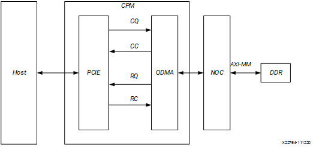

## Tutorial Design File

Before running the lab, download the top_impl.xdc constraints file available in the [reference design file](https://www.xilinx.com/cgi-bin/docs/ctdoc?cid=%20d744977f-750a-4b9e-ae87-d357a2c4e039%3Bd%3D%20pg347-versal-cpm-dma-v3-0-labs.zip). To do so:

1.  Download the [reference design
    file](https://www.xilinx.com/cgi-bin/docs/ctdoc?cid=%20d744977f-750a-4b9e-ae87-d357a2c4e039%3Bd%3D%20pg347-versal-cpm-dma-v3-0-labs.zip) from the Xilinx website.
2.  Extract the ZIP file contents into any write-accessible location.
3.  Locate the top_impl.xdc constraints file.

The provided top_impl.xdc constraints file contains the needed DDR pins and their placement for this tutorial lab. The constraints file can be modified as needed for later use.

## Start the Vivado Design Suite

1.  Open the AMD Vivado&trade; Design Suite.
2.  Click **Create Project** from the Quick Start Menu.
3.  Step through the popup menus to access the Default Part page.
4.  In the Default Part page, search for and select **xcvp1202-vsva2785-2MP-e-S-es1** .
5.  Continue to the Finish stage to create the new project and open AMD Vivado.
6.  In the AMD Vivado Flow Navigator, click **IP Integrator → Create Block
    Design**. A popup dialog displays to create the block design.

    
7.  Click **OK**. An empty block design diagram canvas opens.

## Instantiate the CIPS IP

1.  Right-click on the block design canvas, and from the context menu
    select **Add IP**.
2.  The IP catalog pops up. In the Search field type CIPS to filter to
    the list of IP.
    
    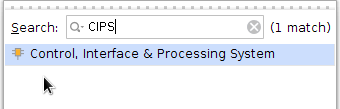
3.  From the filtered list, double-click the **Control, Interface, and
    Processing System** IP core to instantiate the IP on the block design canvas.
4.  This adds the AMD Versal adaptive SoC CIPS IP to the canvas. Double-check **Versal
    CIPS IP**.
5.  CIPS configuration page opens. Make sure Design flow has **Full
    System** selected and click **Next**.
    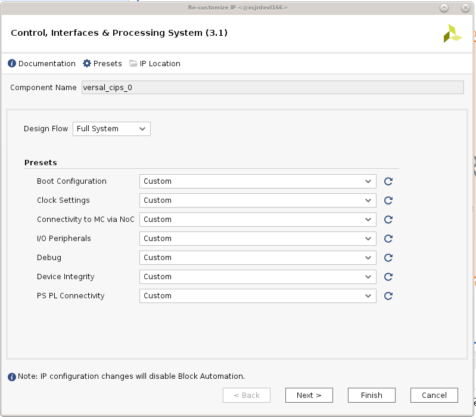
6.  CIPS PS and CPM configuration page opens. Select **CPM**.
    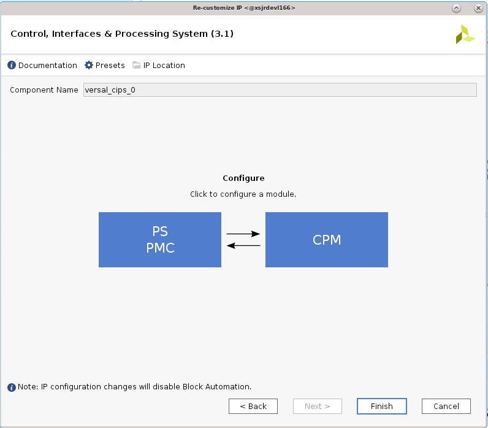
7.  CPM5 Configuration dialog box will open. Select the **CPM5 Basic
    Configuration** option.
8.  Set the PCIe Controller 0 Modes to **DMA**, and set the lane width
    to **X16**. Available lane widths are X1, X2, X4, X8 and X16.
    

## CPM Configuration

1.  In the Configuration Options pane, select **CPM5 PCIE Controller 0
    Configuration** to customize DMA.
2.  In the Basic tab, set the following options:
    * CPM Modes: **Advanced**.
    * PCIE0 Functional Mode: **QDMA**.
    * Maximum Link Speed: **8.0 GT/s** (Gen3).
    * DMA Interface option: **AXI Memory Mapped**.
    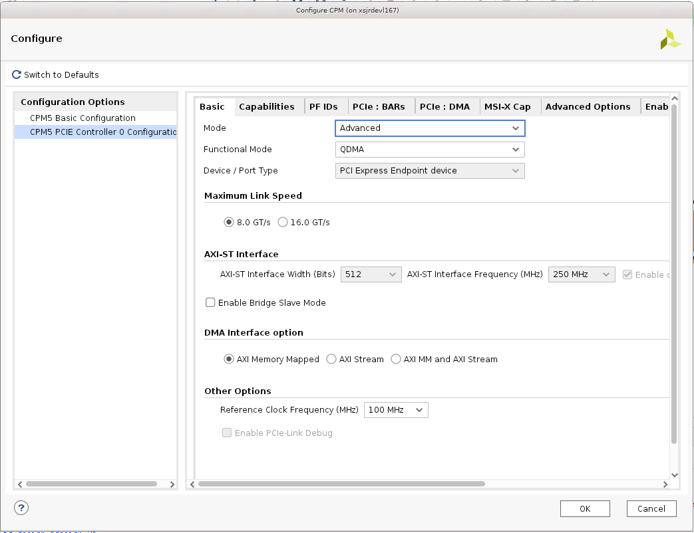
3.  In the Capabilities tab, set the following option:
    *  Total Physical Functions: **4**
    *   MSI-X Options: **MSI-X Internal**
 
    This option enables the CPM5 QDMA in MSI-X internal mode.
    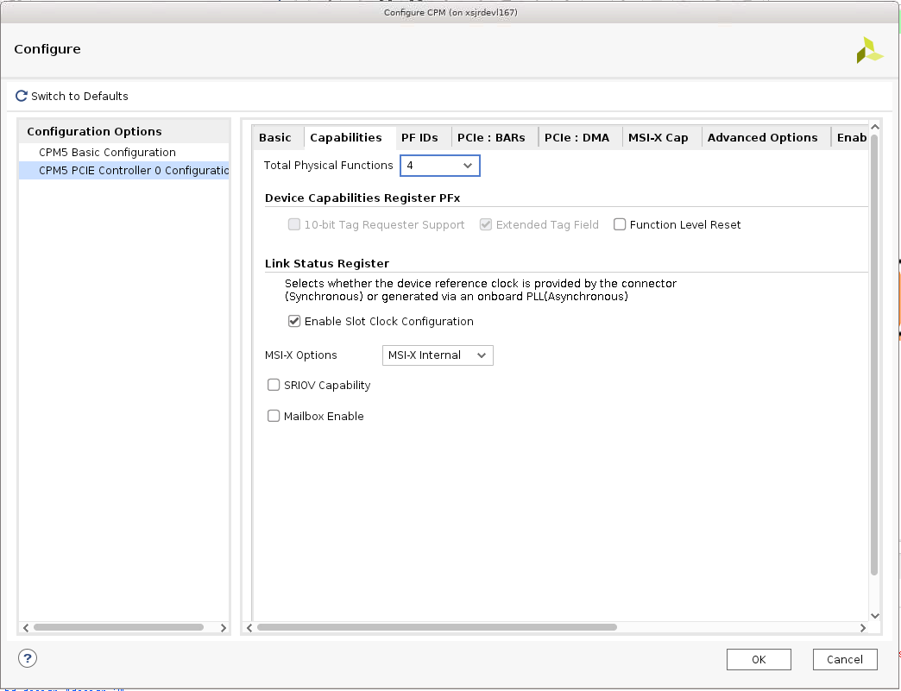
4.  In the PF ID tab, there are 4 PFs listed with device ID. Based on
    your need, you can modify the device ID. For this lab we will keep
    the default device ID.
5.  In the PCIe: BAR tab, set the following options:
    
    First row (for BAR0):
    * Select the **Bar** checkbox.
    * Set type to **DMA**.
    * Select the **64 bit** checkbox.
    * Select the **Prefetchable** checkbox.
    * Set size to **128 Kilobytes**. 
    
    Second row (for BAR2):

    * Select the **Bar** checkbox.
    * Set type to **AXI Bridge Master**.
    * Select the **64 bit** checkbox.
    * Select the **Prefetchable** checkbox.
    * Set size to **4 Kilobytes**.

    The same Bar options can be copied for all 4 PFs. Depending on your needs, you can modify the BAR selection for all PFs. For this lab, we will copy PF10 selection to all 3 PFs. To do so, click **Copy PF0**.

    ***Note*:** By default, DMA is not selected for any BAR. Select the DMA option in Type section to select DMA BAR.
    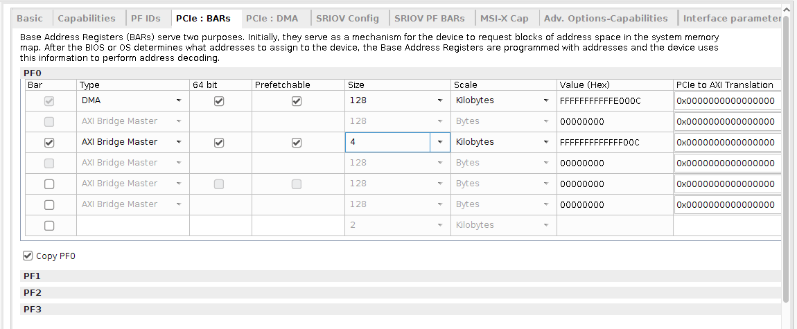
6.  In the PCIe: DMA tab keep all default selections.
7.  Click **OK** to configure CPM.
8.  Select **PS PMC** to configure PCIE reset and DMA reference clock
    output pin.
9.  Select the IO option to configure PCIe reset pin.
10. For CPM PCIE Controller 0 \[End Point\] select "PMC_MIO 32" in I/O.
    (Based on user design and which controller select reset pin)

    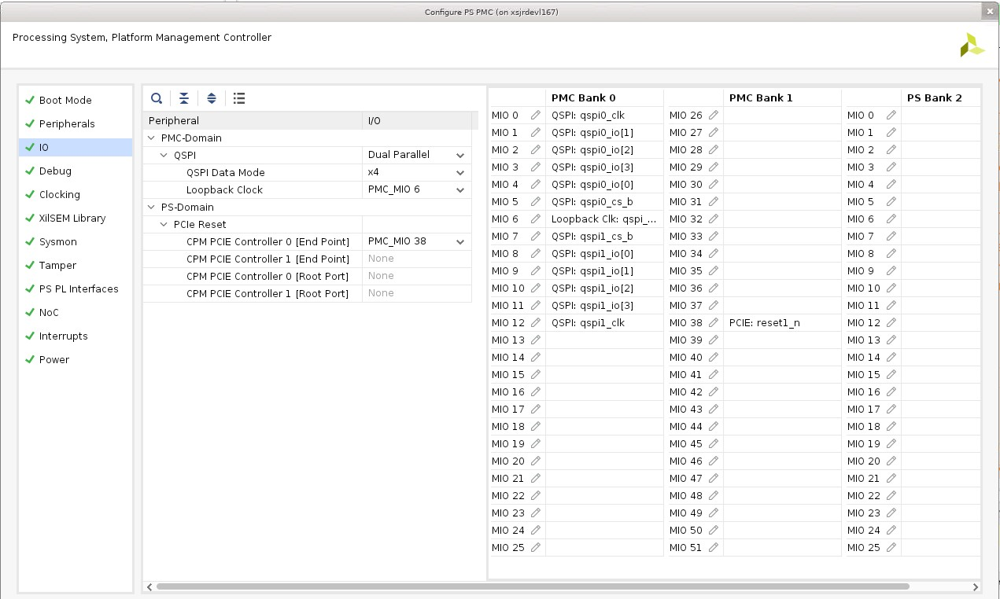
11. Select Clocking option to generate a 250MHz DMA reference clock.
    * Select the **Output Clocks** tab
    * Select **PMC Domain Clocks**" and **PL Fabric Clocks**.
    * Select **PL CLK 0**, and enter 250 MHz in the Requested Freq (MHz) column.

    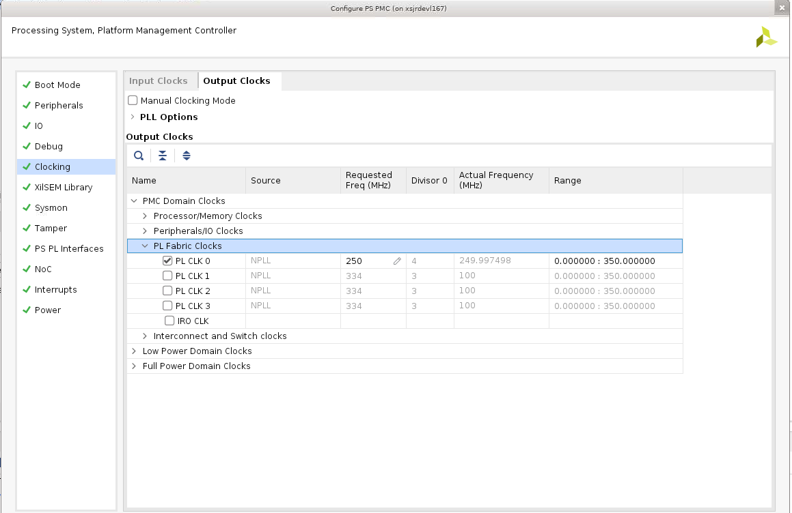
12. Click **Finish** configuring PS PMC.
13. Click Finish tp generate CIPS IP.

## NoC Configuration

Next you will add and configure a Network on Chip (NoC) IP core for the DDR connection.

1.  Right-click the block design canvas and from the context menu select
    **Add IP**.
2.  The IP catalog pops up. In the Search field type AXI NoC to filter a
    list of IP.
3.  From the filtered list, double-click the **AXI NoC** IP core to
    instantiate the IP on the block design canvas. Customize the IP as follows:
4.  In the General tab, set the following options:
    * Number of AXI Slave Interfaces: **2**.
    * Number of AXI Master Interfaces: **0**.
    * Number of AXI Clocks: **2**.

    The number of AXI clocks is set to two because there are two clocks needed for the AXI Slave input, and none needed for AXI Master output.

    * Memory Controller: **Single Memory Controller**.
    * Number of Memory Controller Port: **4**.
    * All others options use the default settings.
    
5.  In the Inputs tab, set the following options. 
    
    First row (for S00_AXI):
    * Connected To: **PS PCIe**.
    * Clock: **aclk0** (input clock).
    * All other options use default settings. 
    
    Second row (for S01_AXI):
    * Connected To: **PS PCIe**.
    * Clock: **aclk1** (input clock).
    * All other options use default settings.
    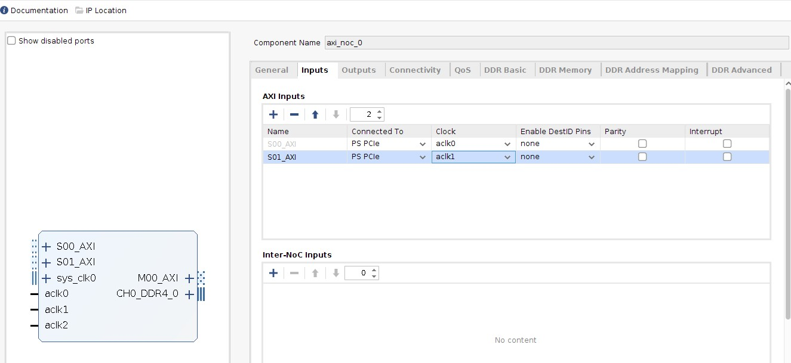
6.  In the Connectivity tab, set the NoC connectivity as follows:
    * For S00_AXI, select the **MC Port 0** checkbox.
    * For S01_AXI, select the **MC Port 0** checkbox.
    * All others options use the default settings.
7.  In the DDR Basic tab, set the following options:
    * Input System clock period (ps): **5000 (200.000 MHz)**.
    * Select the **Enable Internal Responder** checkbox.
    * All others options use the default settings.
    

    ***Note*:** This is a sample configuration. Your DDR configuration and frequencies should be based on your design requirements.
8.  In the DDR Memory tab, set the following options:
    * Memory Device Type: **Components**.
    * Memory Speed Grade: **DDR4-3200AA(22-22-22)**.
    * Base Component Width: **x16**.
    * All others options use the default settings.
    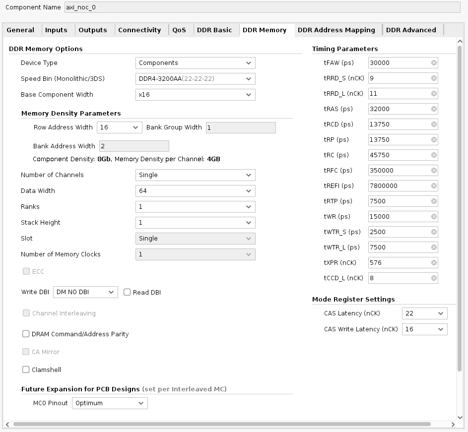
9.  Click **OK** to generate a NoC IP with DDR.

## IP Configuration

1.  Make the connections between the IP cores as shown in following
    figure.
2.  Set GT_REFCLK_D, GT_PCIEA0_RX, GT_PCIEA0_TX,SYS_CLK0, and CH0_DDR4_0
    as primary ports. To do so:

    a. Select pins gt_refclk0, and PCIE0_GT of versal_cips_0, SYS_CLK0 and CH0_DDR4_0 of axi_noc_0 by pressing **Ctrl+click**.

    b. Click the **Make External (Ctrl + T)** icon in the toolbar at the
    top of the canvas.

3.  Connect NoC/CIPS ports as shown in picture.
4.  Connect "pl0_ref_clk" from CIPS output to "dma0_intrfc_clk" CIPS Input (DMA input clock)
5.  Add a Constant IP, and configure the IP to generate a constant value of logic 1 and connect to dma0_intrfc_resetn input reset port.
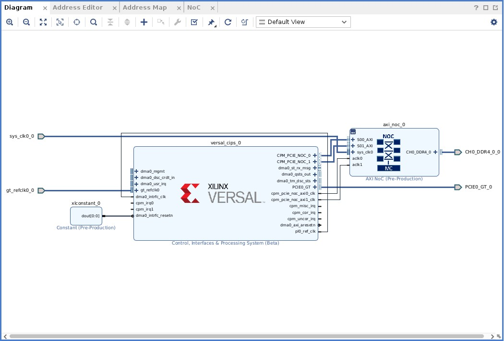

## Address Settings

Next, set the necessary address settings for the NoC IP.

1.  Open the **Address Editor** tab as shown in the following figure. Expand the tree by clicking the down-arrow on **versal_cips_0**. Expand **DATA_PCIE0**, and expand **DATA_PCIE1**.
2.  For S00_AXI, right-click in the Master Base Address cell, and select **Assign** from the context menu.
3.  And similarly for S01_AXI, right-click in the Master Base Address cell, and select **Assign** from the context menu.

    ***Note*:** The address 0x00000 is assigned to the DDR.
    

## Validate the Block Design

1. To validate the design open the Diagram tab, and click the **Validate Design** icon , or right- click anywhere in the canvas and, from the context menu, select **Validate Design**.

    After validation, confirmation of the successful validation displays in a pop up window.

## Create a Design Wrapper

After validation, create a design wrapper. A design wrapper file enables you to add any needed logic. For this lab, additional logic is not needed.

1.  In the AMD Vivado IDE Sources window, right-click on **design_1 (design_1.bd)**.
2.  From the context menu, select **Create HDL Wrapper** to generate a
    wrapper file.

    A design_1\_wrapper file is added to the Sources window as shown in the following figure.
    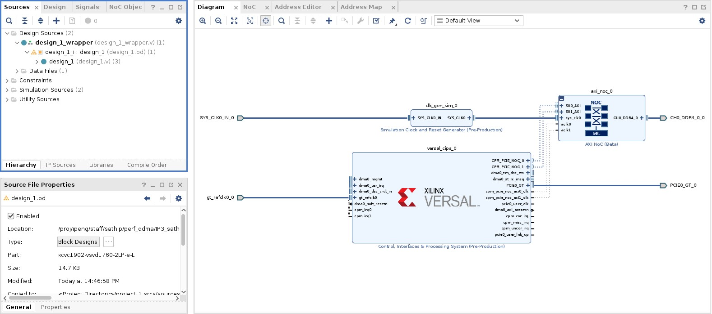

 **Synthesize and Implement the Design**

After the wrapper file is created, you will add the constraints file top_impl.xdc, which is provided with this guide, to your design in AMD Vivado. The constraints file constrains DDR pin placement. Then, you can run synthesis and implementation, which generates a PDI (Programmable Device Image) file.

***Note*:** To locate the top_impl.xdc constraints file, first download the [reference design file](https://www.xilinx.com/cgi-bin/docs/ctdoc?cid=%20d744977f-750a-4b9e-ae87-d357a2c4e039%3Bd%3D%20pg347-versal-cpm-dma-v3-0-labs.zip) file and extract its contents.

1.  In the Flow Navigator window, click **Add Sources**, click **Add or
    create Constraints**, and add the top_impl.xdc file.
2.  In the Flow Navigator, click **Synthesis and Implementation** to
    implement the project design and generate the PDI file.

Copyright © 2020–2023 Advanced Micro Devices, Inc

<a href="https://www.amd.com/en/corporate/copyright">Terms and Conditions</a>

