<table width="100%">
 <tr width="100%">
    <td align="center"><h1>Versal&trade; Adaptive SoC Tutorials for CPM DMA and Bridge Mode for PCIe&reg;</h1>
    </td>
 </tr>
</table>

# Lab 4: XDMA AXI MM Interface to NoC and DDR Lab

This lab describes the process of generating a AMD Versal&trade; adaptive SoC XDMA design with AXI4 Memory Mapped interface connecting to DDR memory. This lab explains a step by step procedure to configure a Control, Interfaces and Processing System (CIPS) XDMA design and network on chip (NoC) IP. The following figure shows the AXI4 Memory Mapped (AXI-MM) interface to DDR using the NoC IP. At the end of this lab, you can synthesize and implement the design, and generate a Programmable Device Image (PDI) file. The PDI file is used to program the AMD Versal adaptive SoC and run data traffic on a system. For host to chip (H2C) transfers, data is read from Host, and sent to DDR memory. For chip to host (C2H) transfers, data is read from DDR memory and written to Host. Transfer can be initiated on all 4 channels.

This lab targets a VCK190 Evaluation board. This lab connects to DDR found outside the AMD Versal adaptive SoC.

**AXI-MM Default Example Design**

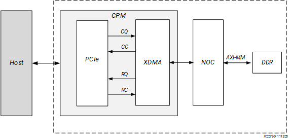

## Start the Vivado Design Suite

1. Open the AMD Vivado&trade; Design Suite.
2. Click **Create Project** from the Quick Start Menu.
3. Step through the popup menus to access the Default Part page.
4. In the Default Part page, select Boards options, and locate and select the **Versal VCK190 Evaluation Platform** option.
5. Continue to the Finish stage to create the new project and open AMD Vivado.
6. In the AMD Vivado Flow Navigator, click **IP Integrator → Create Block Design**. A popup dialog displays to create the block design.

    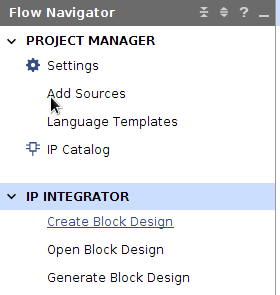

7. Click **OK**. An empty block design diagram canvas opens.

## Instantiate the CIPS IP

1. Right-click on the block design canvas, and select **Add IP**.
2. The IP catalog pops up. In the Search field type CIPS to filter to the list of IP.

    
3. From the filtered list, double-click the **Control, Interface, and Processing System** IP core to instantiate the IP on the block design canvas.
4. This adds the AMD Versal adaptive SoC CIPS IP to the canvas. Double-click the **Versal CIPS IP**.
5. In the CIPS configuration page, make sure Design flow has Full System selected and click **Next**.
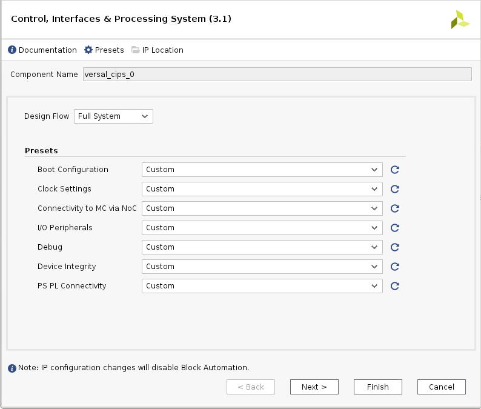
6. In the CIPS PS and CPM configuration page, select **CPM**.
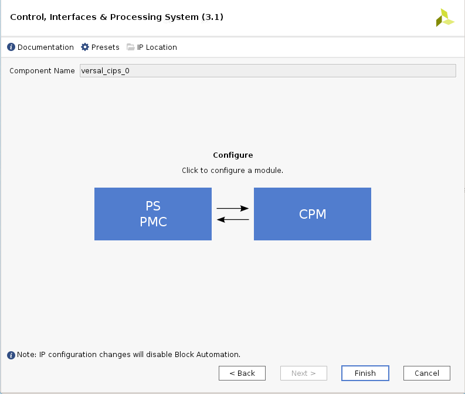
7. CPM4 Configuration dialog box will appear. Select the **CPM4 Basic Configuration** option.
8. Set the PCIe&reg; Controller 0 Modes to **DMA**, and set the lane width to **X16**. Available lane widths are X1, X2, X4, X8 and X16.
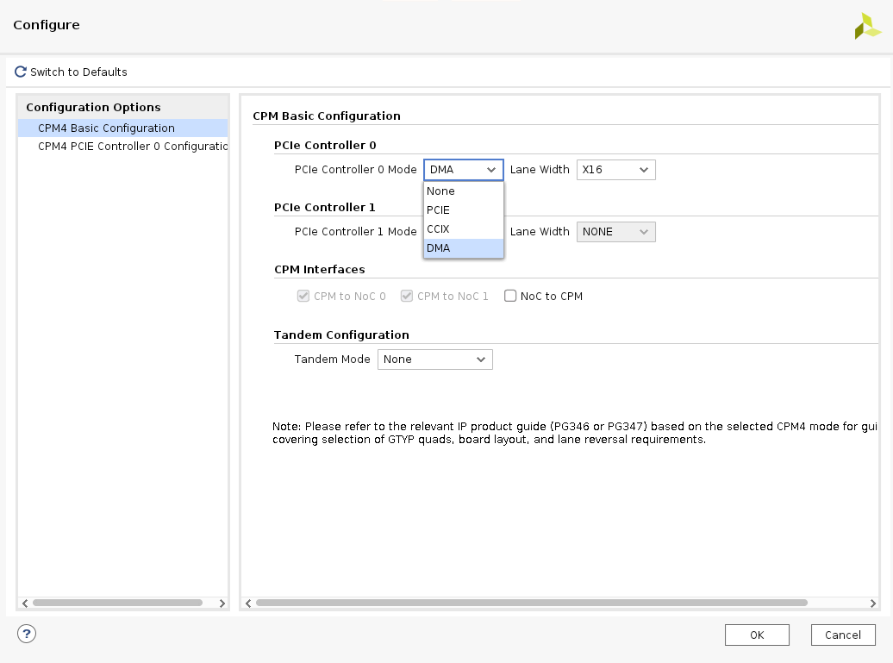

## Set the PCIe Reset Pin

Because the Board option is selected, there is no need to select a pin for PCIe Reset. However, if the Evaluation Board option is not selected, and the user application has a AMD Versal adaptive SoC part, then the PCIe Reset pin must be set correctly. Follow the steps below to set the PCIe Reset pin.

1. In the CIPS PS CPM Configuration page, select **PS-PMC**, and click **IO Configuration**.

    The IO Configuration page displays with a list of options to configure the CPM-PCIe functional mode.

2. In the Peripheral column, select the **PCIe Reset** checkbox. 

    Notice that only A0 End Point is selectable in the I/O column.

    Notice also that the multi-use I/O (MIO) pin selected in PCIe reset is automatically connected to the PCIe Reset I/O, in this case MIO 38.

3. Next to A0 End Point, select **PS MIO 38**, which is the MIO pin that matches the MIO pin is connected in your board.

    Available MIO pin selections are PS MIO 18, PMC MIO 24, and PMC MIO 38.

    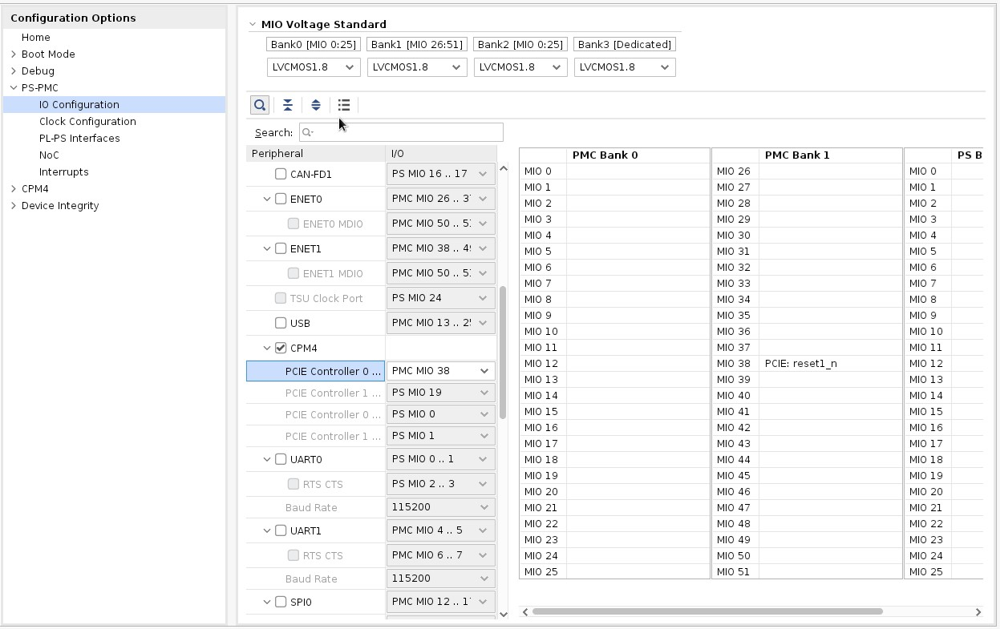

## CPM Configuration

1. In the Configuration Options pane, select **CPM4 PCIE Controller 0 Configuration** to customize the DMA.
2. In the Basic tab, set the following options:
    -   PCIe0 Basic/Advanced mode selection: **Advanced**
    -   PCIE0 Functional Mode: **DMA**
    -   Maximum Link Speed: **8.0 GT/s** (Gen3)
    -   DMA Interface option: **AXI Memory Mapped**
    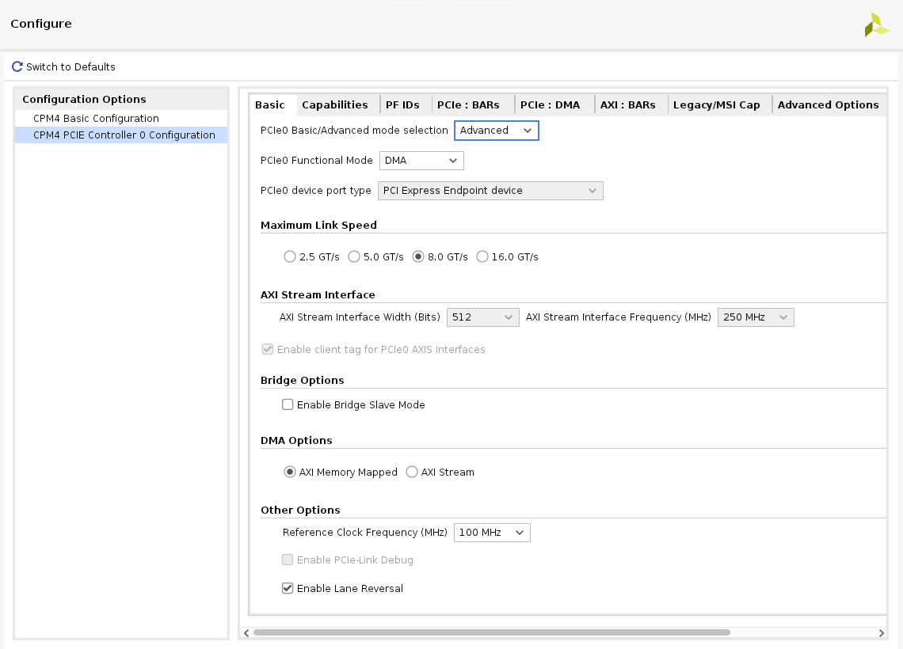
3. In the Capabilities tab, set the following option:
    -   MSI-X- Options: **MSI-X Internal**

    This option enables the CPM XDMA in MSI-X internal mode.

    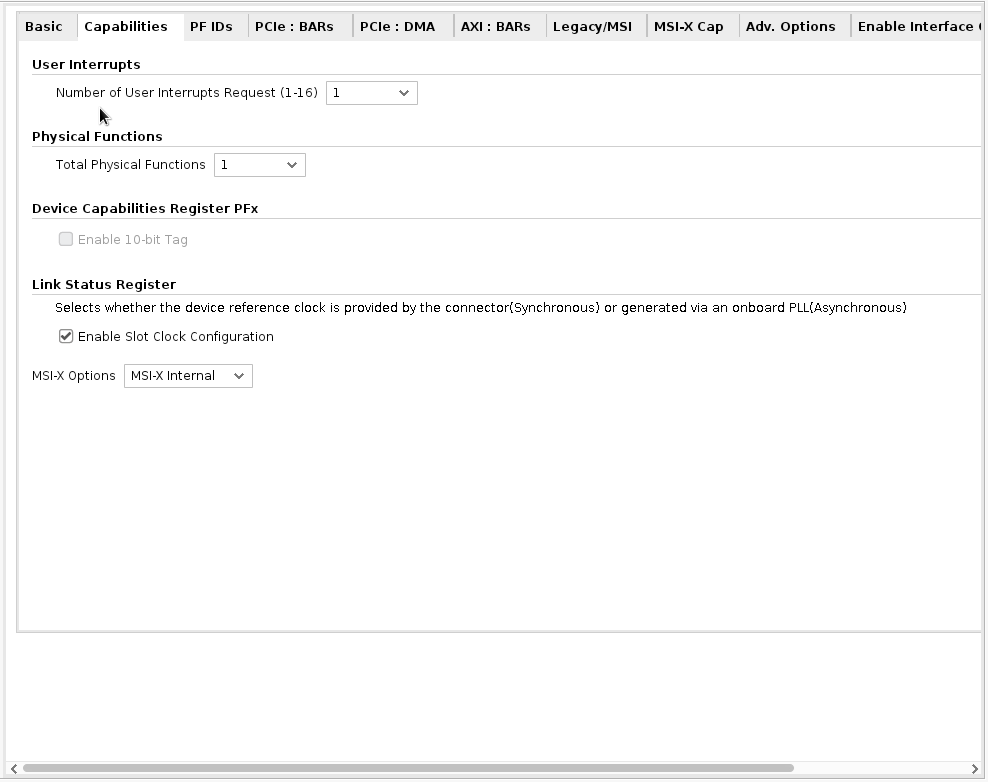

4. In the PCIe: BARs tab, set the following options: 

    First row (for BAR0):

    -   Select the **Bar** checkbox.
    -   Set type to **DMA**.
    -   Set size to **128** Kilobytes. 
    
    Second row (for BAR1):
    -   Select the **Bar** checkbox.
    -   Set type to **AXI Bridge Master**.
    -   Set size to **4** Kilobytes.

    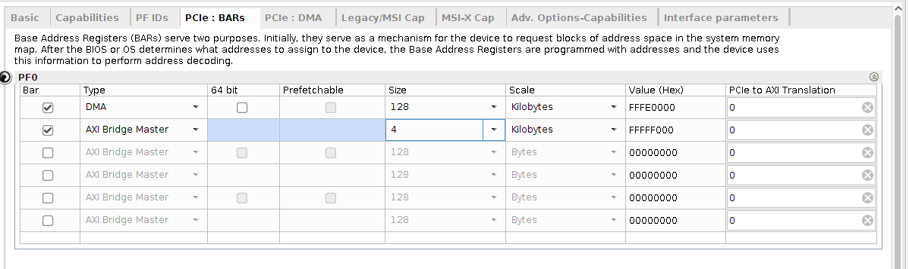
5. In the PCIe: DMA tab, set the following options:
    -   Number of DMA Read Channel (H2C): **4** (for 4 channels).
    -   Number of DMA Write Channel (C2H): **4** (for 4 channels).

    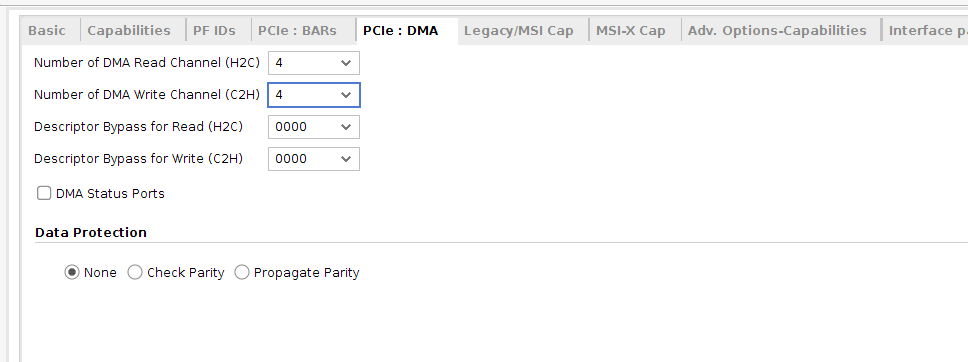
6. In all other tabs, keep the default settings.
7. Click **OK** and click **Finish** in the CIPS configuration page to generate the CIPS XDMA IP. The generated IP core displays in the Diagram tab.

    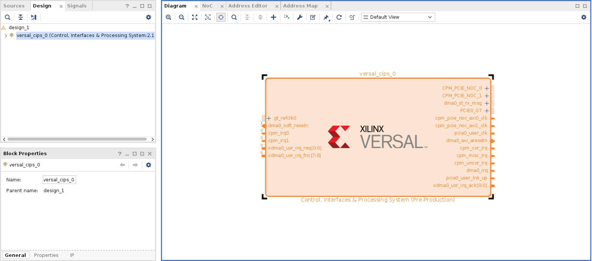

## NoC Configuration

Next you will add and configure a Network on Chip (NoC) IP core for the DDR connection.

1. Right-click the block design canvas and from the context menu select **Add IP**.
2. The IP catalog pops up. In the Search field type AXI NoC to filter a list of IP.
3. From the filtered list, double-click the **AXI NoC** IP core to instantiate the IP on the block design canvas. Customize the IP as follows:
4. In the General tab, set the following options:
    -   Number of AXI Slave Interfaces: **2**.
    -   Number of AXI Master Interfaces: **0**.
    -   Number of AXI Clocks: **2**.

    The number of AXI clocks is set to two because there are two clocks needed for the AXI Slave input, and none needed for AXI Master output.
    -   Memory Controller: **Single Memory Controller**.
    -   Number of Memory Controller Port: **4**.
    -   All others options use the default settings.
    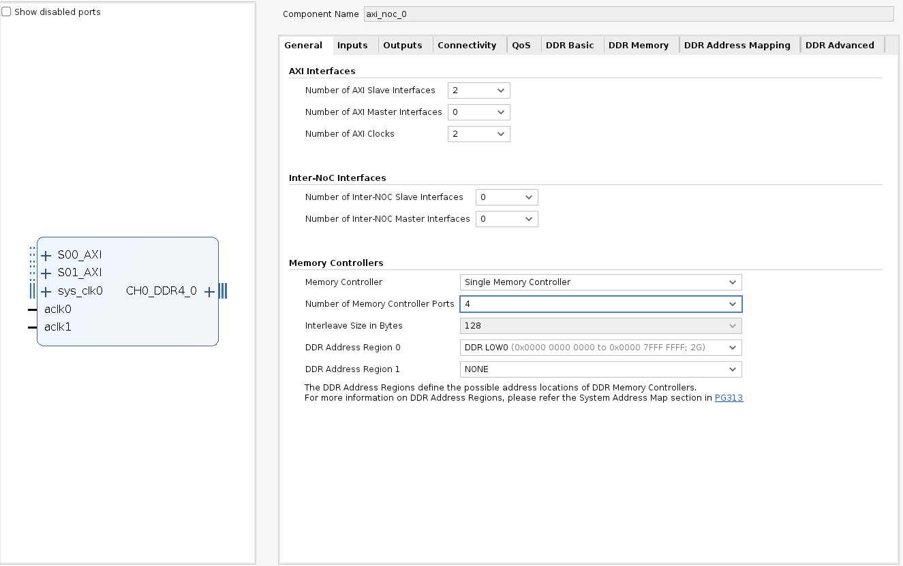
5. In the Inputs tab, set the following options. 

    First row (for S00_AXI):
    -   Connected To: **PS PCIe**.
    -   Clock: **aclk0** (input clock).
    -   All other options use default settings. 

    Second row (for S01_AXI):

    -   Connected To: **PS PCIe**.
    -   Clock: **aclk1** (input clock).
    -   All other options use default settings.
    
6. In the Connectivity tab, set the NoC connectivity as follows:
    -   For S00_AXI, select the **MC Port 0** checkbox.
    -   For S01_AXI, select the **MC Port 0** checkbox.
    -   All others options use the default settings.
7. In the DDR Basic tab, set the following options:
    -   Input System clock period (ps): **5000 (200.000 MHz)**.
    -   Select the **Enable Internal Responder** checkbox.
    -   All other options use the default settings.
    

    ***Note*:** This is a sample configuration. Your DDR configuration and frequencies should be based on your design requirements.
8. In the DDR Memory tab, set the following options:
    -   Memory Device Type: **Components**.
    -   Memory Speed Grade: **DDR4-3200AA(22-22-22)**.
    -   Base Component Width: **x16**.
    -   All others options use the default settings.
    
9. Click **OK** to generate a NoC IP with DDR.

## Generate the Clock for the NoC IP

Next, generate a clock source for the NoC module. To do this, you will configure and generate the Simulation Clock and Reset Generator IP core.

1. Click **Add IP**, and search for Simulation Clock and Reset Generator.
2. From the filtered list, double-click the **Simulation Clock and Reset Generator** IP core to instantiate the IP on the block design canvas. Configure the core as follows:
3. For Number of SYS clocks, select **1**.
4. For Sys Clock 0 Frequency (MHz), enter **200**.
5. For Number of AXI Clocks, select **0**.
6. For Number of Resets Ports, select **0**.
7. Click **OK** to generate IP.

    

## IP Connections

Next, add signal connections between the IP in the AMD Vivado IP integrator.

1. Make the connections between the IP cores as shown in following figure.
2. Set GT_REFCLK_D, GT_PCIEA0_RX, GT_PCIEA0_TX, SYS_CLK0_IN and CH0_DDR4_0 as primary ports. To do so:

    a. Select pins GT_REFCLK_D, GT_PCIEA0_RXand GT_PCIEA0_TX of versal_cips_0, SYS_CLK0_IN of clk_gen_sim_0, and CH0_DDR4_0 of axi_noc_0 by pressing **Ctrl+click**.
    
    b. Click the **Make External (Ctrl + T)** icon in the toolbar at the top of the canvas.

    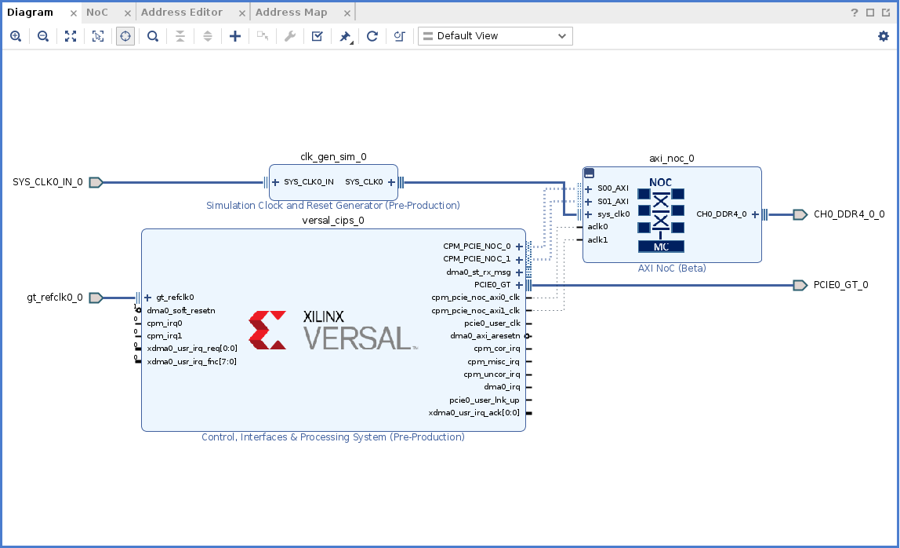

## Address Settings

Next, set the necessary address settings for the NoC IP.

1. Open the **Address Editor** tab as shown in the following figure. Expand the tree by clicking the down-arrow on **versal_cips_0**. Expand **DATA_PCIE0**, and expand **DATA_PCIE1**.
2. For S00_AXI, right-click in the Master Base Address cell, and select **Assign** from the context menu.
3. And similarly, for S01_AXI, right-click in the Master Base Address cell, and select **Assign** from the context menu.

    ***Note*:** The address 0x00000 is assigned to the DDR.

    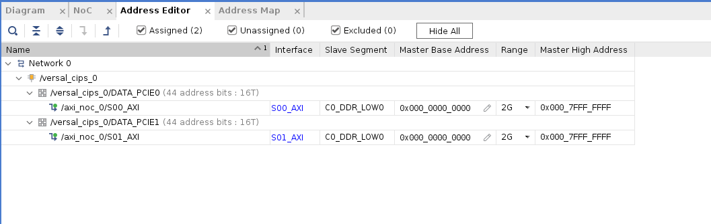

## Validate the Block Design

1. To validate the design, open the Diagram tab, and click the **Validate Design** icon , or right- click anywhere in the canvas and, from the context menu, select **Validate Design**.

    After validation, confirmation of the successful validation displays in a pop up window.

## Create a Design Wrapper

After validation, create a design wrapper. A design wrapper file enables you to add any needed logic. For this lab, additional logic is not needed.

1. In the AMD Vivado IDE Sources window, right-click on **design_1 (design_1.bd)**.
2. From the context menu, select **Create HDL Wrapper** to generate a wrapper file.

    A design_1\_wrapper file is added to the Sources window as shown in the following figure.

    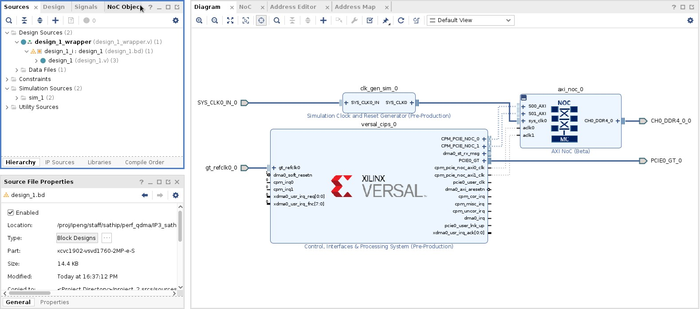

## Synthesize and Implement the Design

The IP package includes the DDR pin placement for the evaluation board. To implement the project design, and generate a Programmable Device Image (PDI) file:

1. In the Flow Navigator, click **Synthesis and Implementation**.

Copyright © 2020–2023 Advanced Micro Devices, Inc

<a href="https://www.amd.com/en/corporate/copyright">Terms and Conditions</a>

